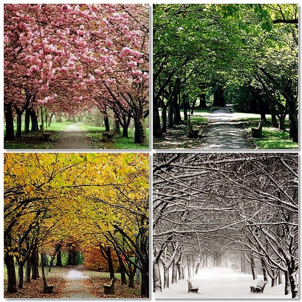
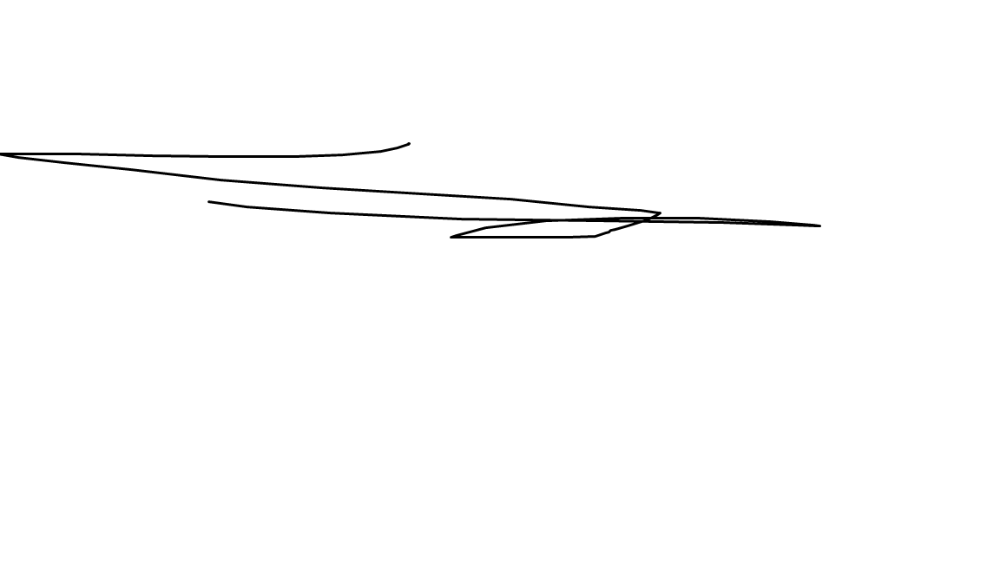

<html lang="pt-br">
	<head>
		<meta charset="UTF-8">
		<title> Curriculo profissional</title>
               

	</head>

	<body>

     <dl>
    

       <dt> Agente Administrativo</dt>
       <dd>2015 - 2016<dd>
       <dd> Universidade Veiga de Almeida </dd>
       <dd> Assistente Administrativo </dd>
             

    

      
      </dl> 
      <table border="3">
        <caption>Idiomas</caption>
        <tr> <th> Línguas</th> <th> Proficiência</th> 
        </tr>
        <tr>
          <td>
          Inglês
          </td>
          <td>Intermediário</td>
        </tr>
<tr>
          <td>
  Espanhol        
  </td>
  <td> básico </td>
        </tr>
     
      </table>
      
  
  
 
